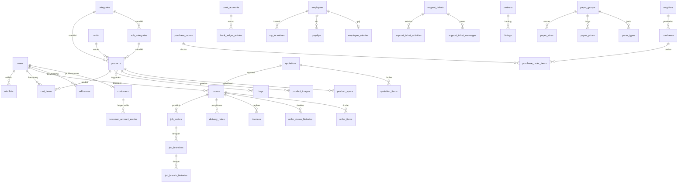

# PRD — Backend Laravel 13 untuk Dulank (Store + Admin)

- **Versi:** 1.0
- **Tanggal:** 2026-10-09
- **Status:** Draft — acuan implementasi backend
- **Repositori acuan:** `dulank-store` (repo ini) dan `dulank-admin` (`/home/bacink/DULANK/2026/dulank-admin`)
- **Pengguna dokumen:** AI agent / developer yang membangun backend Laravel 13

---

## 0. Keputusan yang Sudah Dikunci

| # | Keputusan | Nilai |
|---|---|---|
| 1 | Cakupan | End-to-end bertahap: store parity → auth → commerce → admin CRUD/upload → notifikasi/laporan |
| 2 | Versi API | `/api/v1` sebagai kanonik + alias `/api` untuk kompatibilitas frontend lama |
| 3 | Database | MySQL 8 / MariaDB (JSON column + enum) |
| 4 | Auth | Laravel Sanctum **API token** dengan abilities `store` dan `admin` |
| 5 | Bahasa dokumen | Indonesia (istilah teknis tetap Inggris) |
| 6 | Struktur backend | **Satu aplikasi Laravel**, pemisahan logis store/admin (route, controller, resource, rate limit, audit trail), model/service/policy bersama |
| 7 | Framework | Laravel 13 (PHP 8.3–8.5, rilis 17 Maret 2026), Pest, Pint |
| 8 | Strategi ID | Primary key bigint surrogate + kolom kode bisnis (`code`/`no`/`*_no`); route model binding memakai kode; API Resource mengekspos `id = kode` selama frontend lama masih memakainya |
| 9 | Uang | Disimpan sebagai integer rupiah murni (tanpa desimal, tanpa string berformat); format tampilan hanya di frontend |
| 10 | Konflik merge `dulank-admin` | **Selesai**: resolusi commit `358e7e8` + `d8b1a40`, lalu normalisasi PascalCase & typecheck 0 error (2026-10-09) |

---

## 1. Latar Belakang & Tujuan

Saat ini kedua frontend berjalan di atas **mock backend**:

- `dulank-store` — Nuxt 4 dengan Nitro server membaca/menulis JSON di `server/data/*.json` (22 file, 26 endpoint).
- `dulank-admin` — Nuxt 4 dengan dua mekanisme mock sekaligus: store in-memory generik (`server/data/*.ts` + `server/utils/mockStore.ts` + `server/api/[...mock].ts`) dan lapisan JSON + domain service (`data/*.json`, `server/data/*.json`, `server/utils/*Data.ts`, endpoint per modul). Terdapat 349 route API, 99 `server/types`, 136 JSON, 188 halaman.

Tujuan PRD ini adalah menjadi **satu-satunya rujukan** saat membangun backend Laravel 13 yang melayani kedua frontend sehingga:

1. Kontrak data yang sudah dipakai frontend tidak berubah tanpa disengaja (kompatibel).
2. Model, relasi, migration, controller, request, resource, dan policy dapat dibuat langsung dari spesifikasi di dokumen ini.
3. Tidak ada logika bisnis yang ditulis dua kali (DRY) — dipakai bersama store dan admin.
4. Data mock lama (store dan admin) dapat diimpor sebagai seed ke database baru.

### 1.1 Non-Goals

- Bukan redesign UI store/admin; frontend hanya disesuaikan pada lapisan pemanggilan API di fase migrasi.
- Bukan multi-tenant/multi-perusahaan pada versi pertama (satu PT Dulank Semesta Cida).
- Bukan redesign arsitektur mock frontend; konflik merge dan dua pola mock admin diselesaikan terpisah.
- Bukan keputusan tentang provider payment gateway/SMS/email final (dibahas per fase integrasi).

---

## 2. Analisis Sistem Saat Ini

### 2.1 Store — `dulank-store`

- **Struktur:** `app/pages/*.vue` (56 route) sebagai composer tipis, `app/components/pages/<route>/`, `app/composables/use*.ts` (14) memanggil `/api/*`, data JSON di `server/data/` (22 file), tipe di `server/types/` (11 file).
- **Envelope response:** `{ success: true, data, meta? }`; `meta` pagination: `{ page, limit, total }` (`server/utils/data.ts` → `createResponse`).
- **Endpoint mock (26):**

| Method | Path | Catatan |
|---|---|---|
| GET | `/api/products` | filter `category`, `search`, `page`, `limit` (maks 100) |
| GET | `/api/products/:slug` | |
| GET | `/api/categories` | |
| GET | `/api/catalog/:kind` | kind: `clients`, `printing-shops`, `paper-stores`, `printing-machines`, `die-cutting-blades`, `paper-prices`, `paper-groups`, `paper-sizes`, `paper-types` |
| GET | `/api/blog` | `page`, `limit` |
| GET | `/api/blog/:slug` | |
| GET | `/api/faqs` | filter `category` |
| GET | `/api/sale-banners` | |
| GET | `/api/cart` | user default 1 |
| POST | `/api/cart` | `productId`, `quantity`, `price`, `spec` |
| PUT | `/api/cart/:itemId` | `quantity` |
| DELETE | `/api/cart/:itemId` | |
| POST | `/api/cart/clear` | |
| GET | `/api/orders` | filter `userId` |
| GET | `/api/orders/:id` | |
| GET | `/api/quotations` | filter `userId` |
| GET | `/api/quotations/:id` | |
| GET | `/api/tickets` | filter `userId` |
| GET | `/api/tickets/:id` | |
| POST | `/api/tickets` | `subject`, `message`, `type`, `priority` |
| POST | `/api/tickets/:id/replies` | `message`, `close` |
| GET | `/api/billings` | filter `userId` |
| GET | `/api/wishlist` | filter `userId` |
| DELETE | `/api/wishlist/:itemId` | **stub, tidak mempersist** |
| GET | `/api/users/:id` | |
| GET | `/api/users/:id/addresses` | |

- **Belum ada di mock store:** auth, `POST /orders` (checkout), `POST/PUT /quotations`, `POST /wishlist`, CRUD alamat, update profil/password/2FA, upload avatar/artwork, admin CRUD katalog.
- **Semua konsumsi API lewat composable/Vue**; legacy JS di `public/js/**` tidak memanggil API.

### 2.2 Admin — `dulank-admin`

- **Skala:** 188 halaman, 517 komponen `.vue`, 141 composable, 356 file API, 99 `server/types`, 17 `shared/types`, 136 JSON (semua terdaftar di `server/utils/bundledData.ts`), 4 layout (`default`, `auth`, `pos`, `print`).
- **Grup modul (sidebar):** Dashboard, Sales, Payment, Workflow, Orders, Webstore, Calculator Apps, Products & Services, Paper Shop, Inventory, Purchases, Promo, Finance & Account, Peoples, HRM, Report, Content, User Management, Setting.
- **Dua arsitektur mock yang hidup berdampingan:**
  1. Generic in-memory CRUD: `server/data/*.ts` → `server/utils/mockStore.ts` → `server/api/[...mock].ts` (`GET`, `POST`, `PUT` batch, `PUT /:id`, `DELETE /:id`); frontend menyinkronkan seluruh koleksi via `useMockSync` (batch PUT).
  2. JSON + domain service: `server/data/*.json` (seed) dan `data/*.json` (runtime) → `server/utils/*Data.ts` → endpoint per modul `server/api/<modul>/...`; fallback serverless lewat `bundledData.ts`.
- **Envelope:** `{ success: true, data, message? | meta? }` (`server/utils/data.ts` → `createResponse`).
- **Beberapa entitas punya dua representasi sekaligus** (contoh: `server/data/customers.ts` + `customers.json`, `orders.ts` + `orders.json`) — berpotensi divergen; Laravel harus mengikuti **satu** skema kanonik (§5).
- **Status perbaikan (terverifikasi ulang 2026-10-09, pasca-resolusi konflik):**
  - ✅ **Konvensi folder PascalCase diterapkan**: seluruh folder di `app/components` (134 direktori, termasuk `Pages/*`) dinamai PascalCase; duplikasi set komponen yang tersuperseded dikonsolidasi, `~`-imports dan 47 impor relatif diperbarui; `MIGRATION_MANIFEST.json` dan docs disinkronkan.
  - ✅ `npm run typecheck` — **0 error** (sebelumnya 216).
  - ✅ `npm run build` — exit 0.
  - ✅ `npm run test:sales` — 13 check lolos.
  - ❌ `npm run validate:structure` — 8 failure, seluruhnya aset legacy Sticky Kit/Summernote yang memang sudah lama hilang (tidak terkait perbaikan).
- Layer `server/types`, `shared/types`, `server/api`, `server/utils`, `server/data`, `app/composables` valid sebagai kontrak; frontend admin siap diadaptasi ke backend Laravel tanpa utang typecheck.

### 2.3 Gap yang Harus Ditutup Laravel

| Area | Kondisi saat ini | Target Laravel |
|---|---|---|
| Auth & sesi | Tidak ada; `userId = 1` hardcoded | Sanctum token, register/login/logout, profil |
| Order creation | UI checkout/order ada, tidak ada endpoint | `POST /orders` + status timeline |
| Quotation | Hanya read | CRUD + status + konversi ke order |
| Wishlist | GET + DELETE stub | CRUD penuh |
| Address | Read | CRUD + master wilayah |
| Admin CRUD | Mock generik/batch | Resource CRUD + validasi + policy |
| Upload | Tidak ada | Storage disk, avatar, artwork, lampiran |
| Persistensi | JSON/in-memory (Netlify tidak durable) | MySQL, transaksi ACID |
| Otorisasi | Tidak ada | Role/permission + policy ownership |
| Laporan | Data mock/agregat manual | Query agregat + export |

---

## 3. Arsitektur Backend Laravel 13

### 3.1 Prinsip

1. **Satu aplikasi, dua audiens.** Store dan admin berbagi model, service, enum, policy, dan migration. Perbedaan hanya pada route group, controller, resource, dan rate limit.
2. **Controller tipis → Service → Repository/Eloquent.** Validasi di FormRequest; otorisasi di Policy; kalkulasi/penomoran/transisi status di Service; query kompleks di scope/repository.
3. **API Resource sebagai satu-satunya bentuk output.** Tidak ada controller yang mengembalikan model mentah.
4. **Enum PHP untuk semua status** (order, quotation, payment, ticket, tipe mesin, dsb.) — tidak ada string status tersebar.
5. **Config terpusat** untuk nilai bisnis global (PPN default, prefix dokumen, limit pagination).
6. **ID kode bisnis** untuk dokumen (order/invoice/quotation/ticket/job) sehingga URL lama dan nomor dokumen tetap unik dan dapat dibaca manusia.

### 3.2 Struktur Direktori yang Diusulkan

```text
app/
  Enums/                        # OrderStatus, QuotationStatus, PaymentStatus, TicketStatus, MachineKind, ...
  Http/
    Controllers/Api/V1/
      Store/                    # controller audiens store
      Admin/                    # controller audiens admin
      CatalogController.php     # /catalog/{kind} generik berbasis registry
    Middleware/                 # EnsureAbility, AuditAdminAction
    Requests/
      Store/  Admin/  Shared/   # FormRequest reusable (Store/Update)
    Resources/
      Store/  Admin/            # API Resource per audiens
  Models/                       # model domain (shared)
  Policies/                     # ownership + admin bypass
  Services/                     # CartService, OrderService, InvoiceService, QuotationService,
                                # PurchaseService, PaymentService, LedgerService, StockService,
                                # PayrollService, WorkflowService, TicketService, CatalogService
  Support/
    ApiResponse.php             # envelope {success, data, meta}
    CatalogRegistry.php         # mapping kind -> model/resource
    DocumentNumber.php          # penomoran dari prefix
  Observers/                    # OrderObserver, PaymentObserver (ledger & timeline)
config/
  dulank.php                    # tax_rate, pagination, prefix default, disk upload
database/
  migrations/  seeders/  factories/
routes/
  api.php                       # memuat v1.php + alias compatibility.php
  api/v1.php                    # memuat store.php + admin.php
  api/store.php
  api/admin.php
  api/compatibility.php         # alias /api/* gaya lama
```

### 3.3 Alur Request

```text
Route (store|admin)
  → middleware auth:sanctum + abilities:store|admin + rate limiter
  → FormRequest (validasi + authorize)
  → Controller (orkestrasi tipis)
  → Service (business logic, DB::transaction, event)
  → API Resource (transformasi output)
  → ApiResponse envelope { success, data, meta? }
```

### 3.4 Envelope, Error, Pagination

- Sukses: `{ "success": true, "data": ..., "meta": { ... } }` — sama seperti mock.
- Error: HTTP status benar (400/401/403/404/409/422) + `{ "success": false, "message": "...", "errors": { field: [..] } }` untuk 422.
- List: query `page`, `limit` (default 20, maks 100; alias `per_page`), `search`, `sort`, `order`, filter domain.
- Meta list: `{ page, limit, total }` (pertahankan kontrak lama; tambahan `last_page` opsional non-breaking).
- Alias lama: `/api/products` → `/api/v1/products`; controller yang sama, tidak ada duplikasi logika.

### 3.5 Auth (Sanctum API Token)

- `POST /api/v1/auth/register` (store), `POST /api/v1/auth/login`, `POST /api/v1/auth/logout`, `GET /api/v1/auth/me`.
- Login mengembalikan `{ token, user }`; token diberi ability `store` atau `admin` sesuai tipe akun.
- Endpoint store memakai middleware `auth:sanctum` + `abilities:store`; endpoint admin memakai `abilities:admin`.
- Admin dapat mengelola sesi/token anggota; 2FA dan reset password masuk Fase 2.
- Jangan hardcode `userId`: `userId` pada request lama diabaikan/di-scope ke user token.

### 3.6 Role, Permission, Policy

- Rekomendasi: **spatie/laravel-permission** (`roles`, `permissions`, `model_has_roles`, `role_has_permissions`) karena admin sudah memiliki UI role/permission matrix (134 sidebar entries).
- Policy per resource dengan pola `before()`: admin dengan permission lolos; user store hanya boleh resource miliknya (`user_id === $user->id`).
- Ability token (`store`/`admin`) adalah lapis pertama; permission granular adalah lapis kedua untuk admin.

### 3.7 Konfigurasi & Nilai Global

```php
// config/dulank.php
return [
  'tax_rate_default' => 11,
  'pagination' => ['default' => 20, 'max' => 100],
  'documents' => [
    'order' => 'SO', 'invoice' => 'INV', 'quotation' => 'QT',
    'purchase' => 'PO', 'delivery_note' => 'DN', 'ticket' => 'TK', 'job' => 'JO',
  ],
  'uploads' => ['disk' => 'public', 'max_kb' => 4096],
];
```

### 3.8 Audit Trail & Queue (Fase lanjut)

- Tabel `activity_logs` (atau spatie/laravel-activitylog) untuk aksi admin yang mengubah data (create/update/delete/status change).
- Queue untuk email/notifikasi, generate PDF, dan job berat; `Queue::route()` (fitur Laravel 13) untuk routing job per kelas.

---

## 4. Skema Database Kanonik

Konvensi umum:

- Semua tabel: `id BIGINT UNSIGNED AUTO_INCREMENT`, `created_at`, `updated_at`; soft delete hanya untuk data master/dokumen yang memang diarsipkan.
- Uang: `BIGINT` (integer rupiah). Kuantitas/berat/ukuran: `DECIMAL` bila pecahan.
- FK: `*_id BIGINT UNSIGNED` + index + `constrained()`; `nullOnDelete` untuk relasi opsional.
- Enum lebih disukai `VARCHAR` + cast enum PHP (mudah evolusi) kecuali butuh query ketat; tetap satu sumber nilai di `app/Enums`.
- Kolom `*_no`/`code` unik + index; route binding by kolom ini.
- Snapshot: nama/harga/alamat pada dokumen disimpan sebagai salinan kolom (bukan hanya FK) agar dokumen historis stabil.

### 4.1 Auth, User & Master Relasi

| Tabel | Kolom inti | Relasi |
|---|---|---|
| `users` | name, email (unik), phone, password, avatar_path, email_verified_at, join_date, last_login_at, company_type, company_name, department_name, npwp, transaction_code, tax_address, attach_tax_invoice | hasMany addresses/orders/quotations/tickets/cartItems/wishlistItems; hasOne customer; hasOne userAdmin; hasOne employee |
| `customers` | user_id (unik), customer_id (kode), customer_type_id, channel (`Online`/`Offline`), date_join, last_seen | belongsTo user/customerType; hasMany accountEntries |
| `customer_types` | name, status | hasMany customers |
| `user_admins` | user_id, admin_code, role utama, status, descriptions | belongsTo user; stores via pivot |
| `employees` | user_id (nullable), employee_code, name, department_id, designation_id (opsional), address, detail_address, phone, join_date, status (`Active`/`Resign`/`Inactive`), gender, dob, join_channel, kontak darurat, email, avatar_path, photo_id_path | belongsTo department; hasOne salary; hasMany payslips/incentives/cashAdvances |
| `departments` | name, status | hasMany employees |
| `designations` | name, status | hasMany employees |
| `stores` | store_name, user_id (manager), address, phone, email, status | hasMany orders, bankAccounts |
| `addresses` | addressable_type/id (polymorph: user/customer/supplier), label/tag, recipient_name, phone, type, name, street, district, city, province, postal_code, country, is_default | morphTo addressable |
| `roles`, `permissions`, `model_has_roles`, `role_has_permissions`, `model_has_permissions` | tabel Spatie | — |
| `personal_access_tokens` | bawaan Sanctum | — |

### 4.2 Produk & Master

| Tabel | Kolom inti | Relasi |
|---|---|---|
| `categories` | name, code (unik), slug, created_by, status | hasMany subCategories/products |
| `sub_categories` | category_id, name, code, description, item_used, created_by, status | belongsTo category; hasMany products |
| `units` | name, short_name, item_used, status | hasMany products |
| `product_variants` | name, values (JSON) | hasMany variantItems |
| `products` | code (unik), slug (unik), name, category_id, sub_category_id, unit_id, store_id (nullable), description, price, price_from, price_to, price_type (`Fixed`/`Range`/`Calculator`), selling_type, quantity, min_order_qty, quantity_alert, min_price, druck_price, min_length, min_width, discount_type, discount_value, tax_type, status, archived_at | belongsTo category/subCategory/unit/store; hasMany images/specs/variants; morphToMany tags; hasMany processes |
| `product_images` | product_id, path, order | belongsTo product |
| `product_specs` | product_id, group/name, options (JSON array string), order | belongsTo product |
| `tags` + `taggables` | tag: name, slug; pivot polymorphic | dipakai products dan blog_posts |
| `product_processes` | product_id, code, process_name, image_path | belongsTo product |
| `workshop_services` | nama, kategori (offset/digital/large format/laminate/pond/poli), spesifikasi JSON, harga, status | dipakai halaman `*-self` |

**Catatan rekonsiliasi produk:** store memakai `name/slug/priceFrom/priceTo/image/specs/tags`; admin memakai `code/categoryId/subCategoryId/unitId/storeId/price/priceType/variants/images/status`. Kanonik = `products` di atas; API Resource store mengirim `priceFrom/priceTo/image` (derived dari varian/default image) dan admin mengirim seluruh field.

### 4.3 Commerce (Cart, Wishlist, Order, Invoice)

| Tabel | Kolom inti | Relasi |
|---|---|---|
| `cart_items` | user_id, product_id, name (snapshot), image, quantity/qty, price, spec, status (`Active`/`Checkout`/`Delete`), job_title (POS) | belongsTo user/product |
| `wishlists` | user_id, product_id, name, image, price, spec, status, added_at, expire_date | belongsTo user/product; unik (user_id, product_id, spec) |
| `orders` | number (unik), user_id, customer_id (nullable), branch_id, channel (`Website`/`POS`/`Quotation`), status, status_by, shipping_method (`Pick Up`/`Shipping`/`Pickup`/`Courier`/`Express`), contact/shipping snapshot JSON, sub_total, delivery_fee, discount, tax, total, paid, due, payment_status, po_no, notes, voucher_code, source_quotation_id, ordered_at | belongsTo user/customer/branch; hasMany items/statusHistories/payments/invoices/deliveryNotes/jobOrders |
| `order_items` | order_id, product_id, name, category, quantity, unit, price, total, spec, artwork, print_result, note, job_title | belongsTo order/product |
| `order_status_histories` | order_id, status, note, occurred_at, created_by | belongsTo order |
| `order_documents` (opsional) | order_id, payload JSON (contact, shipping, notes, voucher, tax_rate) | dipakai dokumen sales/quotation |
| `invoices` | invoice_no (unik), order_id, customer_id, invoice_date, due_date, amount, paid, amount_due, status (`Paid`/`Partial`/`Unpaid`/`Cancelled`) | belongsTo order; hasMany payments |
| `delivery_notes` | dn_no (unik), order_id, date, customer/shipping snapshot, status, po, shipping_by, reference, receive_by, security, driver, issued_by | hasMany items |
| `delivery_note_items` | delivery_note_id, description, qty, unit, packing_qty, weight | belongsTo deliveryNote |
| `sales_returns` | return_no (unik), order_id, date, customer, payment_status, payment_date, payment_method, total, notes | hasMany items; hasOne refundPayment |
| `sales_return_items` | sales_return_id, name, description, qty_order, qty_return, unit, price, return_amount, reason | belongsTo salesReturn |
| `payments` | payable_type/id (polymorph: invoice/purchase/cash_advance/sales_return/payroll), direction (`in`/`out`), ref_no, date, amount, method, bank_account_id, status, notes | morphTo payable; belongsTo bankAccount |
| `quotations` | no_quotation (unik), user_id/customer_id, date, due_date, valid_until, status (`Draft`/`Pending`/`Send`/`Ordered`/`Rejected`/`Complete`), channel (`Online`/`Sales Staff`/`Offline`), customer snapshot (name/email/phone), sub_total, discount, tax_rate, tax, shipping_cost, total, document JSON (contact, shipping, terms[], signature, position, prices_include_tax) | hasMany items; hasOne order (hasil konversi) |
| `quotation_items` | quotation_id, product_id, product_name, description, moq, order_qty, unit, unit_price, amount | belongsTo quotation |
| `request_quotations` | no_request (unik), customer, email, telp, date, status (`Ordered`/`Complete`/`Pending`/`Received`), due_date, payment_term, document JSON (to, att, items[], requested_to[], signature) | hasMany recipients (opsional tabel sendiri) |
| `reviews` | customer_id/user_id, product_id, product_name, user_email, date, rating (1–5), title, review, status (`Publish`/`Unpublish`) | belongsTo product/user |
| `contact_messages` | name, email, phone, message, date, status (`Pending`/`Answered`) | — |
| `banners` | title, image_url, type (`main`/`product`), position, redirect_url, start_date, end_date, status, order, description | — |
| `sale_banners` (store lama) | title, discount, image | bisa dipetakan ke `banners` tipe `product` |
| `coupons` | name, code (unik), type (`Fixed`/`Percentage`), discount, limit, used, valid, status | — |
| `discounts` | name, value, type, plan_id, valid_from, valid_till, days JSON, products JSON, used, status | belongsTo discountPlan |
| `discount_plans` | name, customers JSON, status | hasMany discounts |
| `vouchers` | name, code (unik), type, discount, limit, used, start_date, end_date, all_products, once_per_customer, status | — |
| `sale_vouchers` | tenant voucher dipakai transaksi | belongsTo order |

### 4.4 Pembelian (Purchases)

| Tabel | Kolom inti | Relasi |
|---|---|---|
| `suppliers` | supplier_id (unik), name, email, contact, pic_name, status, date, address (via `addresses`) | hasMany purchases/purchaseOrders/purchaseReturns |
| `purchase_categories` | name, status | hasMany purchaseItems |
| `purchase_items` | category_id, code, product/name, description, merk, price, unit | belongsTo category |
| `purchases` | no_purchase (unik), supplier_id, date, status (`Received`/`Complete`/`Ordered`/`Pending`), amount, paid, due, payment_status (`Paid`/`Unpaid`/`Partial`/`Refunded`), shipping_cost, tax, notes | hasMany items/payments; hasMany inputTaxDocuments |
| `purchase_items_lines` (detail PO) | purchase_id, name, qty, unit, price, total | belongsTo purchase |
| `purchase_orders` | no_po (unik), date, no_purchase, supplier_id, amount, po_status (`Sent`/`Draft`/`Cancel`), goods_status (`Scheduled`/`Complete`/`Cancel`/`Pending`), goods_date, goods_by, term_of_payment, delivery_date, delivery_address, vendor_reff, tax_rate | hasMany items |
| `purchase_order_items` | purchase_order_id, name, qty, unit, price | belongsTo purchaseOrder |
| `purchase_returns` | no_pr (unik), no_purchase, supplier_id, date, amount, paid, due, status, status_by, notes | hasMany items/payments |
| `purchase_return_items` | purchase_return_id, name, qty, return_qty, unit, price, amount, reason | belongsTo purchaseReturn |

### 4.5 Keuangan & Akuntansi

| Tabel | Kolom inti | Relasi |
|---|---|---|
| `bank_accounts` | branch_id, account_type_id, account_name, bank_name, account_no, opening_balance, ifsc, description, status | hasMany ledgerEntries; hasMany payments/transfers |
| `bank_account_types` | name, status | hasMany bankAccounts |
| `bank_ledger_entries` | bank_account_id, branch_id, direction (`credit`/`debit`), amount, occurred_at, reference_type (`opening_balance`/`payment`/`transfer`/`income`/`expense`/`cash_advance`/`adjustment`), reference_id, description | belongsTo bankAccount; morphTo reference |
| `money_transfers` | no (unik), branch_id, from_account_id, to_account_id, amount, description, occurred_at, created_by | belongsTo fromAccount/toAccount; menulis 2 ledger entries |
| `cash_advances` | employee_id, bank_account_id, date, total_cash, installment_count, period (`Daily`/`Weekly`/`Monthly`), note | hasMany history/payments; derived: installment_amount, total_paid, outstanding, status |
| `income_categories` | name, description, status | hasMany incomes |
| `incomes` | date, no (unik), name, category_id, notes, amount, payment_method, bank_account_id, is_cancelled | belongsTo category/bankAccount; menulis ledger |
| `expense_categories` | name, status | hasMany expenses |
| `expenses` | no_expense (unik), date, category_id, name, status, amount, paid, due, description, payment_method, bank_account_id | belongsTo category/bankAccount; hasMany payments |
| `tax_rates` | name, rate, status | dirujuk quotation/order/purchase |
| `input_tax_documents` | purchase_id, invoice_date, faktur_no, credited (`Yes`/`No`) | belongsTo purchase; view: dpp, vat, supplier |
| `output_tax_documents` | order_id/sale_id, etax_date, etax_number, tx_code, status (`Issued`/`Draft`/`Cancelled`) | belongsTo order; view: dpp, vat, total |
| `customer_account_entries` | customer_id, source_type (`opening_balance`/`sale`/`payment`/`adjustment`), source_id, amount, occurred_at, note | saldo customer = agregat ledger (jangan simpan `balance` sebagai kolom input) |
| `billings` | dipetakan ke `invoices` (store lama) | — |

### 4.6 HRM & Payroll

| Tabel | Kolom inti | Relasi |
|---|---|---|
| `employee_salaries` | employee_id, name, salary, system (`Monthly`/`Weekly`/`Daily`), allowance_total, overtime_rate, status | hasMany allowances; hasOne employee |
| `employee_salary_allowances` | employee_salary_id, name, amount | belongsTo employeeSalary |
| `payslips` | slip_no (unik), employee_id, period, salary_rate, day_worked, allowance, overtime, deduction, total, status (`Paid`/`Unpaid`), paid_date | belongsTo employee; hasMany items |
| `payslip_items` | payslip_id, label, qty, rate, amount | belongsTo payslip |
| `incentives` | code, employee_id, period, qty_complete, total_amount, status (`Paid`/`Pending`) | belongsTo employee |
| `my_incentives` | employee_id, job_order_id, branch_id, date, job_title, flow_name, process, incentive (rate), unit, qty, amount, status | belongsTo employee/jobOrder/jobBranch |

### 4.7 Workflow & Produksi

| Tabel | Kolom inti | Relasi |
|---|---|---|
| `flow_categories` | code, name, used_count, created_by | hasMany flowNames |
| `flow_names` | code, category_id, name, incentive, unit, flow_type (`Inhouse`/`Outsource`), assignees JSON | belongsTo category; hasMany steps |
| `flow_templates` | code, name, information | hasMany steps |
| `work_flows` | no (unik), date, category_id, product_id, workflow_steps (ringkas), steps JSON | hasMany steps; belongsTo product/category |
| `work_flow_steps` | work_flow_id, name, category, template, order | belongsTo workFlow |
| `job_orders` | no (unik), order_id, customer_id, branch_id, product_id, flow_id, flow_type, due_date, customer snapshot, product snapshot, job_title, qty, priority, status (`Waiting`/`On Process`/`Completed`), workflow_type, workflow_category (`Design`/`Pracetak`/`Cetak`/`Finishing`), sales_no, sales_date, shipping, order_summary, assigned_to, input_specs JSON, output_specs JSON | hasMany steps/branches/incentives |
| `job_order_steps` | job_order_id, name, status (`done`/`active`/`pending`), order | belongsTo jobOrder |
| `job_branches` | no (unik), job_order_id, order_no, customer_id, branch_id, branch, customer, product, flow_name, priority, status, job_title, description, qty, date, date_finish, info_list JSON, after_info_list JSON, assignees JSON, incentive_amount, incentive_unit | belongsTo jobOrder; hasMany history/incentives |
| `job_branch_histories` | job_branch_id, date, branch, customer, flow_name, date_finish | belongsTo jobBranch |
| `job_progress` | progress_code, product, description, process, completed_by, time, note, is_completed | belongsTo jobOrder (opsional) |

### 4.8 Support

| Tabel | Kolom inti | Relasi |
|---|---|---|
| `support_tickets` | ticket_no (unik), user_id, customer_id, requested_by, customer_email, customer_phone, subject, assignee_id, priority (`High`/`Medium`/`Low`), status (`Open`/`Pending`/`Closed`), created_date, due_date, description, tags JSON | belongsTo user/assignee; hasMany messages/activities |
| `support_ticket_messages` | ticket_id, author_type (`user`/`support`), author_id, message, created_at | belongsTo ticket; menyatukan `replies` store dan `chat` admin |
| `support_ticket_activities` | ticket_id, type, title, description, author, status_color, occurred_at | belongsTo ticket |

### 4.9 Konten

| Tabel | Kolom inti | Relasi |
|---|---|---|
| `blog_posts` | slug (unik), title, excerpt, content, published_at/date, author_id (nullable) atau author_name, image, status | morphToMany tags; belongsTo category |
| `blog_categories` | name, status | hasMany posts |
| `blog_tags` | name, status | morphToMany posts |
| `blog_comments` | blog_post_id, comment, rating, author, status (`Publish`/`Unpublish`) | belongsTo post |
| `faqs` | question, answer, faq_category_id, order | belongsTo faqCategory |
| `faq_categories` | name | hasMany faqs |
| `clients` | name, logo_url, svg_path, view_box, website, category, status, order | — |
| `download_files` | name, type, size, path, date | — |
| `footers` / `footer_links` | config footer (infoKami, panduan, sosial) | hasMany links |
| `appearance_settings` | theme, logo, favicon, warna | singleton |
| `languages` + `language_translations` | code, name, flag, rtl, progress | hasMany translations |

### 4.10 Katalog Kalkulator & Marketplace

| Tabel | Kolom inti | Relasi |
|---|---|---|
| `partners` | type (`printing_shop`/`paper_store`), name, avatar, province, city, district, address, join_date, subscribed, whatsapp, followers_count, following_count, image, status | hasMany listings/metrics |
| `partner_metrics` | partner_id, paper_count, printing_count, lamination_count, die_cutting_count, foil_count, group_count, type_count | belongsTo partner |
| `listings` | partner_id, type (`paper_group`/`paper_type`/`paper_price`/`paper_size`/`machine`), payload JSON, status (`Active`/`Inactive`/`Frozen`), published, deleted_at | belongsTo partner |
| `moderation_histories` | listing_id, action, duration, notify, message, acted_by, acted_at | belongsTo listing |
| `paper_groups` | owner_type (`self`/`vendor`), partner_id (nullable), source (nullable string), name, merk, price_type, status | hasMany types/prices/sizes |
| `paper_types` | paper_group_id, partner_id, name, merk, gsm, dimension, unit, stock, unit_stock, price, min_order, multiple, status | belongsTo group/partner |
| `paper_prices` | paper_group_id, paper_type_id, name, min_order, multiple, price, status | belongsTo group/type |
| `paper_sizes` | paper_group_id, name, dimension, length, width, unit, status | belongsTo group |
| `machines` | owner_type (`self`/`vendor`), partner_id, kind (`printing`/`lamination`/`die_cutting`/`foil`), source, name, type (`Offset`/`Digital Printing`), colors, size, max_area, plate_cost, minim, druck, price, unit_price, rate_cm, putus_rate, putus_minim, kiss_rate, kiss_minim, published, active, status | belongsTo partner |
| `die_cutting_blades` | name, price_per_cm, published, active | — |
| `calculator_components` | kind (`fixed`/`minimum`/`jasa_lain`), name, value/rate, minim, unit, used, status | — |
| `profit_tiers` | min_qty, max_qty, profit_pos_percent, profit_webstore_percent | dipakai kalkulator cetak-full-color/calender |

### 4.11 Settings (Singleton)

Rekomendasi: **satu tabel `settings`** `(id, group, key, value JSON, updated_by)` + kelas typed config per domain, agar 20+ halaman setting tidak menjadi 20 tabel. Kelompok yang terverifikasi dari mock:

`company`, `invoice`, `email`, `printer`, `payment_gateway`, `sms_gateway`, `social_auth`, `security`, `storage`, `calendar`, `pos`, `otp`, `prefixes`, `preferences`, `gdpr`, `appearance`, `system_integrations`, `currency`, `ban_ip` (ini list, boleh tabel sendiri), `custom_field` (perlu tabel sendiri karena list dinamis).

Khusus `prefixes`: nilai prefix nomor dokumen per jenis (order, invoice, quotation, purchase, dst.) — dipakai `DocumentNumber`.

### 4.12 Wilayah & Data Pendukung

`provinces`, `regencies`, `districts` (dari `public/json/*.json` store dan `data/provinces.json` admin) + `postal_codes`; seed sekali, read-only.

### 4.13 ERD Ringkas



---

## 5. Rekonsiliasi Store ↔ Admin

| Domain | Store | Admin | Kanonik | Aturan |
|---|---|---|---|---|
| Produk | `Product` (slug, priceFrom/To, specs, tags) | `Product` (code, FK kategori/unit/store, price, priceType, varian, gambar) | `products` + `product_specs` + `product_images` + `product_variants` + `product_tag` | `code` = identitas admin, `slug` = identitas store; keduanya unik; `priceFrom/priceTo` dihitung dari varian/harga atau disimpan sebagai kolom range |
| Kategori | `Category` (productCount) | `Category`/`SubCategory` | `categories` + `sub_categories` | `product_count` dihitung (`withCount`), bukan kolom |
| User/Customer | `User` + `UserAddress` | `MemberUser`, `CustomerRecord`, `UserAdmin`, `Employee` | `users` + `customers` + `user_admins` + `employees` + `addresses` | Satu akun auth (`users`); peran menentukan profil turunan |
| Alamat | `UserAddress` | master `address` (customer/supplier) | `addresses` polymorphic | `type` label dipertahankan sebagai kolom |
| Order | `Order` (artwork/printResult/timeline) | `Order`, `Sale`, `PosOrder` | `orders` + `order_items` + `order_status_histories` | `channel` membedakan Website/POS/Quotation; nomor dokumen dari prefix |
| Sale/POS | — (hanya order store) | `Sale`, `POSCartItem`, `HeldOrder` | `orders` (channel POS) + `order_documents` (contact/shipping/voucher/tax) + `payments` | `saleNo` menjadi `orders.number` |
| Quotation | `Quotation` + `customerInfo` | `Quotation` + `QuotationDocument` | `quotations` + `quotation_items` | `document` JSON menyimpan contact/shipping/terms/signature; PPN dari `tax_rates` |
| RFQ | — | `RFQItem`/`RFQDocument` | `request_quotations` | Duplicate RFQ = copy header + recipients |
| Invoice/Billing | `Billing` | `Invoice` | `invoices` + `payments` | `paid`/`amount_due`/`status` dihitung dari pembayaran |
| Support | `SupportTicket` + `replies` | `SupportTicket` + chat + activities + assignee | `support_tickets` + `support_ticket_messages` + `support_ticket_activities` | `replies.from = user/support` menjadi `author_type` |
| Blog/FAQ/Banner/Client | read-only | CRUD | tabel yang sama | Admin menulis, store membaca (hanya status publish) |
| Cart/Wishlist/Review/Checkout/Contact | transaksi pelanggan | monitoring | tabel yang sama | Admin melihat semua, store hanya milik user |
| Kertas & Mesin | read-only marketplace | self + vendor | `paper_*` + `machines` + `partners` + `listings` | `owner_type`/`partner_id` membedakan; `published`/`active` untuk moderasi |
| Tax/Pajak | 11% hardcoded di frontend | `tax_rates` | `tax_rates` | Semua perhitungan pajak dari DB/config, bukan literal frontend |
| User admin/role | — | `UserAdmin`, `Role`, `Permission` | `user_admins` + Spatie tables | Ability token `admin` + permission granular |

### 5.1 Strategi Migrasi Data Mock

1. **Seeder importer** (`php artisan dulank:import {store|admin}`) membaca JSON/TS seed lama dan menulis ke tabel baru dengan urutan FK yang benar.
2. **Admin master data menang** untuk katalog/produk/kertas/mesin/settings; **store menang** untuk transaksi pelanggan (cart/checkout/order/quotation/ticket) karena lebih lengkap.
3. Konflik ID: gunakan natural key (`code`, `slug`, `*_no`, email) untuk deduplikasi; simpan pemetaan ID lama → baru di tabel `legacy_id_map` bila diperlukan.
4. ID tunggal (angka) di store dan ID unik lain di admin akan dinormalkan ke bigint + kode; API Resource mengembalikan `id` sebagai kode untuk endpoint yang sebelumnya memakai kode.
5. Gambar: path `/images/...` (store) dan `/assets/img/...` (admin) dipetakan ke disk `public` (`storage/app/public/...`), lalu API mengembalikan URL. Tabel pemetaan `media_paths` tidak diperlukan bila proses impor menuliskan path final langsung.

---

## 6. Kontrak API

### 6.1 Konvensi

- Base kanonik: `/api/v1`; alias kompatibilitas lama: `/api` (file `routes/api/compatibility.php`, controller sama).
- Store API: `/api/v1/*` (token ability `store` atau publik).
- Admin API: `/api/v1/admin/*` (token ability `admin` + permission).
- List response selalu berisi `meta` (`page`, `limit`, `total`).
- Filter tanggal memakai `startDate` dan `endDate` (format `YYYY-MM-DD`), sesuai konvensi admin yang sudah ada.
- File upload memakai `multipart/form-data`; response berisi URL final.

### 6.2 Store API

**Publik (tanpa auth):**

| Method | Path | Padanan mock |
|---|---|---|
| GET | `/products`, `/products/{slug}` | sama + filter/sort |
| GET | `/categories` | sama |
| GET | `/catalog/{kind}` | sama (registry, §7.1) |
| GET | `/blog`, `/blog/{slug}` | sama |
| GET | `/faqs` | sama |
| GET | `/sale-banners` | sama |
| GET | `/clients` | via catalog |
| GET | `/regions/provinces`, `/regions/regencies`, `/regions/districts` | baru |
| POST | `/auth/register`, `/auth/login` | baru |

**Terautentikasi (ability `store`):**

| Method | Path | Padanan mock |
|---|---|---|
| POST | `/auth/logout`, GET `/auth/me` | baru |
| GET/POST | `/cart` | sama (`POST /cart` = add item) |
| PUT/DELETE | `/cart/{itemId}` | sama |
| POST | `/cart/clear` | sama |
| GET/POST | `/wishlist` | GET sama; POST baru (mock stub) |
| DELETE | `/wishlist/{itemId}` | perbaiki stub jadi hapus nyata |
| GET/POST | `/orders` | GET sama; POST baru (checkout) |
| GET | `/orders/{id}` | sama |
| GET/POST | `/quotations`, GET/PUT `/quotations/{id}` | GET sama; create/update baru |
| GET/POST | `/tickets`, GET `/tickets/{id}` | sama |
| POST | `/tickets/{id}/replies` | sama |
| GET | `/invoices`, `/invoices/{id}` | padanan `billing` |
| GET/POST/PUT/DELETE | `/addresses`, `/addresses/{id}` | baru |
| GET/PUT | `/profile` | baru |
| PUT | `/profile/password`, `/profile/2fa` | baru |
| POST | `/uploads/avatar`, `/uploads/artwork` | baru |

### 6.3 Admin API (per keluarga modul)

Semua path di bawah prefix `/api/v1/admin`. Pola umum: `GET list` (filter), `POST`, `GET {id}`, `PUT {id}`, `DELETE {id}`; dokumen memakai kode sebagai `{id}`.

| Modul | Base path | Entitas utama & aksi khusus |
|---|---|---|
| Sales | `/sales` | order channel POS/staff; `POST /sales/{id}/payments`, `POST /sales/{id}/void`, `GET /sales/history`, `POST /sales/import-voucher` |
| Invoice | `/invoices` | daftar + `POST /invoices/{id}/payments`; create dari sales |
| Delivery Note | `/delivery-notes` | CRUD dokumen + item |
| Sales Return | `/sales-returns` | CRUD + `POST /sales-returns/{id}/refund` |
| Quotation | `/quotations` | CRUD + `POST /quotations/{id}/order` (konversi) |
| RFQ | `/request-quotations` | CRUD + `POST /request-quotations/{id}/duplicate` |
| Payment | `/payments`, `/payment-inflows`, `/payment-outflows` | list + aksi payment |
| Orders | `/orders`, `/orders/stats` | monitoring + status; `POST /orders/{id}/status` |
| Workflow | `/work-flow`, `/flow-categories`, `/flow-names`, `/flow-templates` | CRUD + step builder |
| Job | `/job-orders`, `/job-branches`, `/job-list`, `/job-progress`, `/my-jobs`, `/my-incentives` | CRUD + `POST /job-branches/{id}/complete` (history + insentif) |
| Webstore | `/carts`, `/checkouts`, `/wishlist`, `/reviews`, `/contact-forms`, `/support-tickets` | monitoring; support tickets punya assignee/chat/activities |
| Calculator | `/catalog/partners`, `/catalog/listings`, `/catalog/moderation-history`, `/catalog/partner-metrics` | moderasi listing (freeze + riwayat) |
| Products | `/products`, `/categories`, `/sub-categories`, `/units`, `/variants`, `/product-processes`, `/cetak-full-color`, `/calender`, `/workshop-services` | CRUD + import CSV/JSON + relasi FK |
| Paper | `/paper-groups`, `/paper-types`, `/paper-prices`, `/paper-sizes`, `/paper-items-self` | self + vendor |
| Machines | `/printing-machines` (kind: printing/lamination/die-cutting/foil), `/die-cutting-blades` | self + vendor |
| Purchases | `/purchases`, `/purchase-orders`, `/purchase-items`, `/purchase-returns`, `/purchase-categories` | CRUD + pembayaran utang |
| Promo | `/coupons`, `/discounts`, `/discount-plans`, `/vouchers`, `/banners` | CRUD + validasi kode |
| Finance | `/bank-accounts`, `/bank-account-types`, `/money-transfers`, `/cash-advances`, `/incomes`, `/expenses`, `/input-taxes`, `/output-taxes`, `/customer-account-entries`, `/finance/account-statements`, `/finance/balance-sheet`, `/finance/cash-flow` | ledger otomatis; laporan agregat |
| Peoples | `/customers`, `/customer-types`, `/suppliers`, `/stores`, `/addresses` | CRUD + saldo customer derived |
| HRM | `/employees`, `/departments`, `/designations`, `/employee-salaries`, `/payslips`, `/incentives` | CRUD + generate payslip |
| User Management | `/users`, `/user-admins`, `/roles`, `/permissions` | CRUD + matrix permission |
| Content | `/blogs`, `/blog-categories`, `/blog-tags`, `/blog-comments`, `/faqs`, `/faq-categories`, `/clients`, `/download-files`, `/footers`, `/appearance` | CRUD + upload |
| Settings | `/settings/{group}` | read/update per grup; `/prefixes`, `/custom-fields`, `/ban-ips` khusus |
| Reports | `/reports/{type}` | agregat + export PDF/Excel; tidak menyimpan tabel |

### 6.4 Kompatibilitas Alias

- Seluruh route store lama `/api/*` dipertahankan sebagai alias ke `/api/v1/*` (satu file, tanpa duplikasi controller).
- Admin lama memakai slug generik (`/api/customers`, `/api/sales`, dst.). Laravel menyediakan route resourceful dengan nama yang sama pada alias `/api/*`; perbedaan bentuk payload (mis. batch `PUT /api/<slug>`) **tidak** dipertahankan — frontend admin akan diadaptasi ke endpoint resourceful di fase migrasinya (lihat §11).
- `GET /api/catalog/{kind}` tetap generik via `CatalogRegistry` (mapping kind → model + resource + policy) untuk menghindari 9+ controller duplikat.

---

## 7. Aturan Bisnis

1. **Pajak:** tarif dari `tax_rates` (default 11%); semua dokumen menyimpan `tax_rate` dan nilai pajak yang dihitung server; frontend tidak lagi hardcode `0.11`.
2. **Penomoran dokumen:** `DocumentNumber::next($type)` berbasis `prefixes` + urutan per periode; tidak boleh ada nomor duplikat (unique index).
3. **Order lifecycle:** `Pending → Awaiting Confirmation → Awaiting Payment → Design → Production → Shipped → Delivered` (+ `Cancelled`); setiap perubahan menulis `order_status_histories`. Channel `POS` mengikuti alur bayar langsung.
4. **Invoice:** `paid`, `amount_due`, `status` dihitung dari tabel `payments`; tidak boleh diinput manual sebagai kolom bebas.
5. **Saldo customer:** agregat `customer_account_entries`; form add/edit customer tidak menerima `balance` (sesuai keputusan audit admin).
6. **Quotation:** validitas dari `valid_until`; konversi ke order menyalin item + snapshot customer; status akhir `Complete`/`Rejected`.
7. **RFQ duplicate:** menyalin header + `requested_to`; nomor baru dibuat; dokumen sumber tidak berubah.
8. **Pembelian:** `paid`/`due`/`payment_status` dari pembayaran; stok bertambah saat status `Received`.
9. **Stok kertas (`paper_types.stock`, `products.quantity`)**: berkurang saat order production/sale; perubahan manual tercatat sebagai adjustment.
10. **Workflow & insentif:** `job_order_steps` status per tahap; saat `job_branches` selesai, tulis history dan buat `my_incentives` per assignee berdasarkan `flow_names.incentive` × qty.
11. **Ticket:** assignee + prioritas + due date; balasan user (`author_type=user`) membuka kembali status `Open`; tutup tiket menulis activity.
12. **Voucher/discount:** validasi kode, batas pemakaian, once-per-customer, rentang tanggal, dan produk terkait di server.
13. **Cart:** kuantitas minimum 1; item dengan kombinasi user+produk+spec yang sama digabung; checkout memindahkan item ke order dan menandai `Checkout`.
14. **Wishlist:** unik per user+produk+spec; mendukung `expired` dari `expire_date`.
15. **Media:** validasi tipe/ukuran di server; simpan ke disk `public`; URL dikembalikan resource.

---

## 8. Roadmap Implementasi

### Fase 0 — Fondasi (prasyarat)

- Setup Laravel 13, MySQL, Sanctum, Pest, Pint, config `dulank.php`, `ApiResponse`, `CatalogRegistry`, enum dasar.
- Migrasi `users`, `customers`, `addresses`, `stores`, roles/permissions (Spatie), wilayah Indonesia (seed).
- Auth token store & admin; seeder importer kerangka.

**Acceptance:** login/register/logout jalan; token store tidak bisa akses endpoint admin; seeder wilayah sukses.

### Fase 1 — Parity Store

- Katalog publik (products, categories, blog, faqs, sale-banners, catalog kinds, clients), cart, wishlist, orders read, quotations read, tickets (read + create + reply), invoices read, profile/addresses read.
- Alias `/api/*` aktif; frontend store berjalan tanpa perubahan pemanggilan.

**Acceptance:** seluruh 26 endpoint mock punya padanan; contract test membandingkan bentuk response dengan mock; UI store berfungsi penuh.

### Fase 2 — Commerce Lengkap

- Checkout `POST /orders` + timeline; cart→order; quotation CRUD + konversi; wishlist CRUD; address CRUD; profile/password/2FA; upload avatar/artwork; invoice/payment store.
- Invoice & payment service + ledger.

**Acceptance:** checkout end-to-end; bukti bayar; status berubah dan tercatat; PPN dari `tax_rates`.

### Fase 3 — Admin Core

- Sales/POS, payment in/out, orders, delivery notes, sales returns, quotations/RFQ, purchases (+PO/return), invoices.
- Role/permission matrix; audit trail; import data mock admin (sales, purchases, customers, suppliers, paper, machines).

**Acceptance:** CRUD admin dengan validasi + policy; laporan dasar; data hasil impor tampil di halaman admin (setelah frontend diadaptasi).

### Fase 4 — Finance, HRM, Workflow

- Bank account/ledger/transfer, cash advance, income/expense, input/output tax, customer account entries, reports keuangan.
- Employee/salary/payslip/incentive, departments/designations.
- Flow/workflow/job orders/job branches/job progress + insentif otomatis.

**Acceptance:** ledger konsisten (saldo = pembukaan + mutasi); payslip dan insentif ter-generate; job branch complete menulis history + insentif.

### Fase 5 — Konten, Setting, Reports, Integrasi

- Content CRUD + upload, settings per grup, custom fields, language, ban IP, appearance.
- Reports agregat + export; dashboard.
- Integrasi payment gateway/SMS/email/queue; hardening keamanan; tuning performa.

---

## 9. Testing & Kualitas

- **Pest** feature test per modul store & admin (`tests/Feature/Store/**`, `tests/Feature/Admin/**`), unit test untuk service kalkulasi (pajak, ledger, insentif, penomoran).
- **Contract test**: fixture response mock lama → assert bentuk response Laravel (`success`, `data`, `meta`).
- **Factory** untuk setiap model; seeder importer diuji idempoten (dijalankan dua kali tidak menggandakan data).
- **Pint** wajib lulus; **Larastan** (opsional) untuk analisis statis.
- **CI**: `pint --test`, `pest`, (opsional) `phpstan`.
- Aturan DRY yang diuji: tidak ada aturan validasi/penomoran/kalkulasi yang tertulis dua kali di controller store dan admin (review checklist).

---

## 10. Risiko & Open Questions

| # | Risiko / Pertanyaan | Dampak | Mitigasi / Rekomendasi |
|---|---|---|---|
| 1 | Sisa merge `dulank-admin` | **Selesai 2026-10-09**: folder komponen dinormalisasi ke PascalCase (134 folder), duplikat set komponen dikonsolidasi, dan `npm run typecheck` 0 error; build & test:sales lolos | Tidak ada mitigasi lebih lanjut; sisa `validate:structure` (8 aset legacy Sticky Kit/Summernote) tidak terkait dan menunggu keputusan kepemilikan aset |
| 2 | Dua arsitektur mock admin (in-memory generik vs JSON+service) dan data ganda `.ts`/`.json` | Skema ganda, data divergen | Laravel mengikuti skema kanonik §4; importer membaca satu sumber per entitas (tetapkan daftar sumber di Fase 0) |
| 3 | ID tidak konsisten (store `number`, admin `string`) | Route/relasi kacau | Strategi ID §0.8; route binding by kode; resource mengekspos `id` sesuai kebutuhan frontend |
| 4 | Endpoint admin lama memakai slug generik + batch PUT `useMockSync` | Adapter Laravel tidak 1:1 | Adaptasi frontend admin per modul di fase migrasi; alias path disediakan, batch PUT tidak |
| 5 | `data/` runtime Netlify tidak durable | Kehilangan data produksi | Laravel + MySQL sebagai sumber tunggal |
| 6 | Settings 20+ halaman: tabel per setting vs key-value | Desain migration | Rekomendasi key-value `settings` + typed config; keputusan final saat Fase 5 |
| 7 | Reports admin belum jelas skema sumbernya | Laporan salah | Definisikan query per laporan di Fase 4; jadikan read-only agregat, tanpa tabel laporan kecuali snapshot tahunan |
| 8 | Upload/PDF/dokumen cetak (11 dokumen khusus admin) | Butuh storage + generator | Storage disk + dompdf/snapshot; jadwalkan Fase 3–5 |
| 9 | Payment gateway/SMS/email belum dipilih | Integrasi tertunda | Fase 5, desain `payment_gateways`/`sms_gateways` sudah ada di mock sebagai acuan konfigurasi |
| 10 | Sinkronisasi wilayah (provinsi/kota/kecamatan) store vs admin | Data ganda | Satu tabel `provinces`/`regencies`/`districts` dari sumber yang sama |
| 11 | Permission granular vs ability token | Authorization bocor | Spatie permission + Policy `before()` admin; uji negatif (store mengakses data user lain → 403) |
| 12 | Format tanggal campuran (`YYYY-MM-DD` vs `DD/MM/YYYY`) | Filter/serah | Normalisasi DB `date`/`datetime`; API memakai ISO; konversi hanya di frontend |

---

## 11. Lampiran

### A. Inventaris `server/types` Admin (99)

`address, appearance-setting, ban-ip, bank-account, bank-setting, banner, blog, calculator-components, calculator-dashboard, calculator-marketplace, calendar-setting, cart, cash-advance, category, cetak-full-color, checkout, client, company-setting, contact-form, currency-setting, custom-fields, customer-type, customer, delivery-note, department, designation, download-file, employee, employeeSalary, expense-category, expense, faq, finance-report, flow-category, flow-name, flow-template, footer, gdpr-setting, incentive, income-category, income, invoice-setting, invoice, job-branch, job-list, job-order, location, money-transfer, my-incentive, my-job, order, paper-price, paper-shop, paper-size, payment-flow, payment-gateway, payment, payslip, pos-setting, pos, preference-setting, printer-setting, printing-machine, product-process, product, profile, purchase-category, purchase-item, purchase-order, purchase-return, purchase, quotation, reports-financial, reports-operations, reports-sales, reports-stakeholders, request-quotation, review, sale, sales-document, sales-return, security-settings, sms-gateway, social-auth, storage-setting, store, sub-category, supplier, support-ticket, system-integrations, system-settings, tax-document, tax-rates, unit, user-management, variant, wishlist, work-flow, workshop-service`

### B. Tipe Store (11)

`blog, cart, category, faq, order, product, quotation, sale-banner, ticket, user, wishlist`

### C. Endpoint Mock Store (26)

Lihat §2.1.

### D. File Data yang Perlu Diimpor

- Store: 22 JSON di `server/data/` (`products, categories, users, addresses, billings, wishlists, cart, tickets, blog, faqs, orders, quotations, printing-machines, printing-shops, clients, paper-*, die-cutting-blades, sale-banners`).
- Admin: 136 JSON di `server/data/` + runtime `data/` (47 JSON) — termasuk sales, purchases, finance, HRM, workflow, content, settings.
- Wilayah: `public/json/provinsi.json`, `kota-kabupaten.json`, `kodepos.json` (store) dan `data/provinces.json`, `regencies.json`, `districts.json` (admin).

### E. Dokumen Internal yang Tetap Berlaku

- `dulank-store`: `AGENTS.md`, `CLAUDE.md`, `docs/ROUTES.md`, `docs/COMPONENTS.md`, `docs/MIGRATION.md`.
- `dulank-admin`: `AGENTS.md` (bersih, versi panduan AI Indonesia), `docs/STRUCTURE.md`, `docs/BACKEND_READY_VERTICAL_SLICE.md`, `docs/CODEBASE_COMPLIANCE_AUDIT_2026-10-09.md`.
